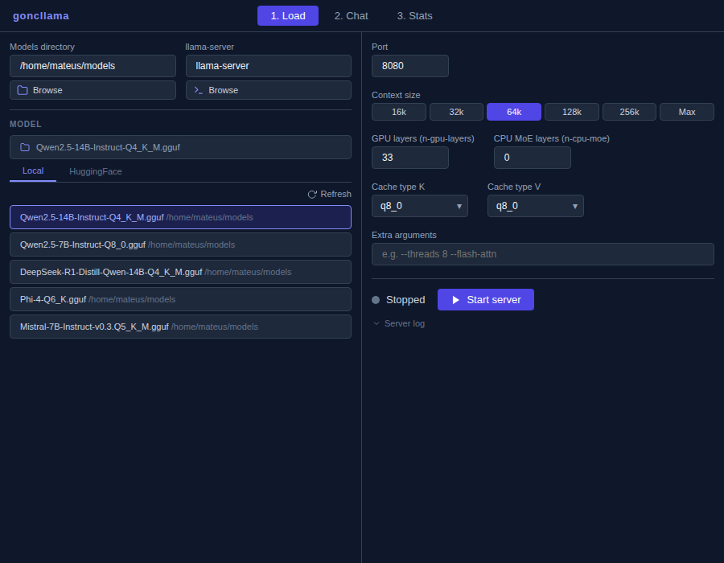
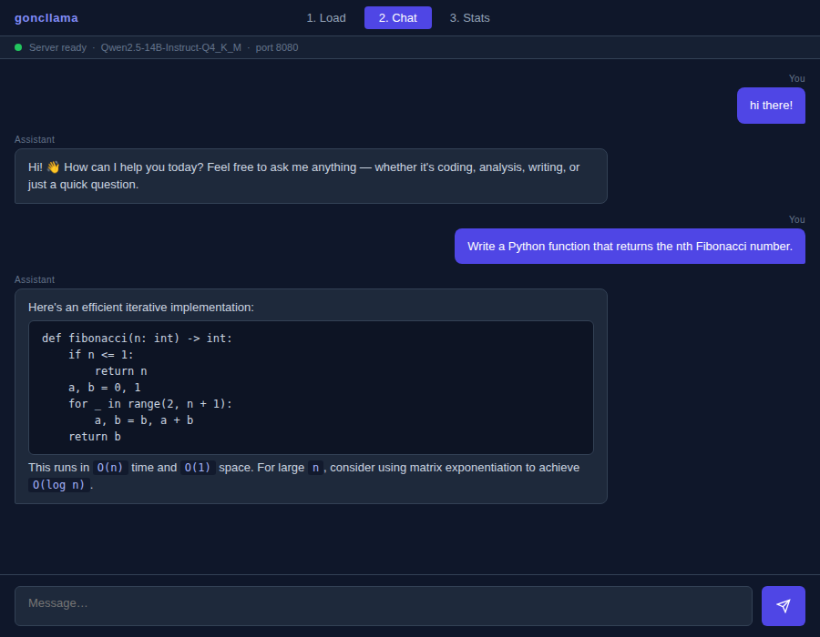
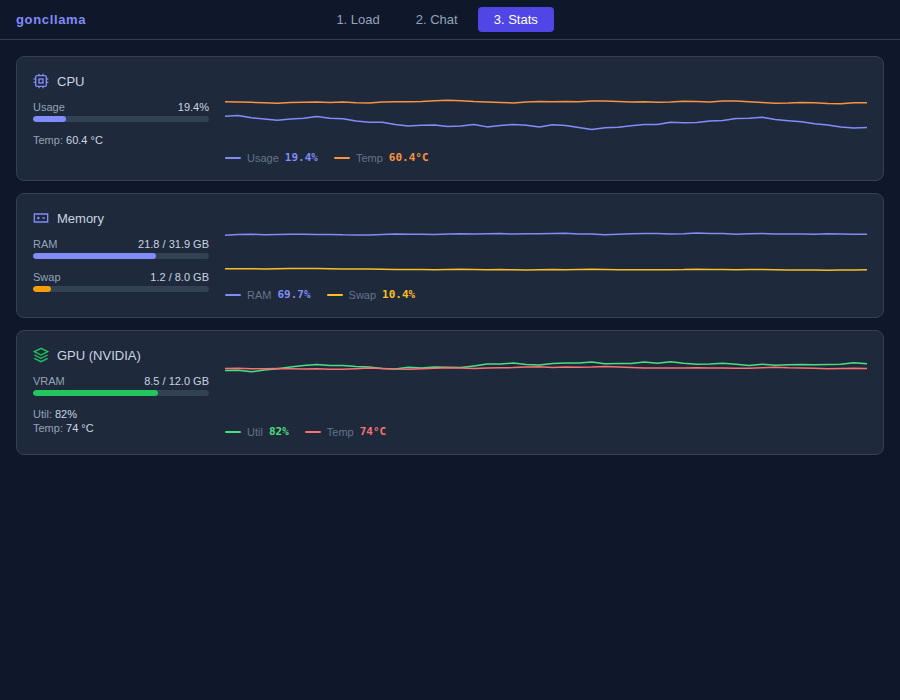

# samalla

A lightweight Linux desktop GUI for [llama.cpp](https://github.com/ggml-org/llama.cpp)'s `llama-server`.
Browse local models or download from HuggingFace, configure and launch the server, chat with streaming output, and watch live CPU/RAM/GPU stats — all in one window.



---

## Features

- **Model management** — browse local `.gguf` files or search HuggingFace and download with a progress bar
- **Server configuration** — context size, GPU layers, CPU MoE layers, KV cache quantization, extra flags
- **One-click launch** — starts `llama-server` as a managed child process; cleans up on app close
- **Rich status** — distinguishes *loading model*, *ready*, and *reasoning* via `/health` + `/slots` polling
- **Streaming chat** — SSE-based `/v1/chat/completions`; assistant responses rendered as Markdown
- **Live stats** — CPU, RAM, Swap, and NVIDIA GPU metrics updated every 2 seconds with rolling line charts
- **Persistent config** — all settings saved to `~/.config/goncllama/config.json` automatically

---

## Screenshots

### Load
Configure your model and server parameters, then start with one click.


### Chat
Chat with the running model. Responses stream in token-by-token with full Markdown rendering.



### Stats
Live system metrics with 2-minute rolling history charts.



---

## Requirements

- Linux (tested on Ubuntu/Fedora with GNOME)
- [Rust](https://rustup.rs/) toolchain
- Node.js ≥ 18
- `webkit2gtk-4.1` and its dev headers
- [`llama-server`](https://github.com/ggml-org/llama.cpp) binary in `PATH` (or configure the path in the app)
- *(Optional)* NVIDIA GPU with drivers for GPU stats

---

## Building from source

```bash
git clone https://github.com/YOUR_USERNAME/samalla.git
cd samalla

# Install frontend dependencies
npm install

# Dev mode (hot reload)
npm run tauri dev

# Production build → src-tauri/target/release/goncllama
npm run tauri build
```

---

## Usage

1. **Load tab** — set your models directory, pick a `.gguf` file (or download one from HuggingFace), adjust parameters, click **Start server**.
2. **Chat tab** — once the status dot turns green, type a message and press Enter or click Send.
3. **Stats tab** — opens automatically alongside the server; shows CPU, memory, and GPU usage in real time.

### Key settings

| Setting | Default | Notes |
|---|---|---|
| Port | `8080` | The port `llama-server` listens on |
| Context size | `64k` | Passed as `--ctx-size`; `Max` passes `0` (llama.cpp default) |
| GPU layers | `33` | `--n-gpu-layers`; set to `999` to offload everything |
| CPU MoE layers | `0` | `--n-cpu-moe` for MoE models |
| Cache type K/V | `q8_0` | KV cache quantization |
| Extra args | — | Any additional `llama-server` flags, space-separated |

---

## Configuration file

`~/.config/goncllama/config.json` is written automatically. Delete it to reset all settings to defaults.

```json
{
  "models_dir": "~/models",
  "llama_server_path": "llama-server",
  "last_model": "",
  "context_size": 65536,
  "n_gpu_layers": 33,
  "n_cpu_moe": 0,
  "cache_type_k": "q8_0",
  "cache_type_v": "q8_0",
  "extra_args": "",
  "server_port": 8080
}
```

---

## Tech stack

| Layer | Technology |
|---|---|
| Desktop shell | [Tauri 2](https://tauri.app/) |
| Frontend | React 18 + TypeScript |
| Styling | Tailwind CSS v4 |
| System stats | [sysinfo](https://crates.io/crates/sysinfo) + [nvml-wrapper](https://crates.io/crates/nvml-wrapper) |
| HTTP / HF | reqwest |
| Markdown | react-markdown + remark-gfm |

See [DESIGN.md](DESIGN.md) for UI/visual design decisions and [AGENTS.md](AGENTS.md) for codebase orientation (useful for AI assistants).

---

## License

MIT
